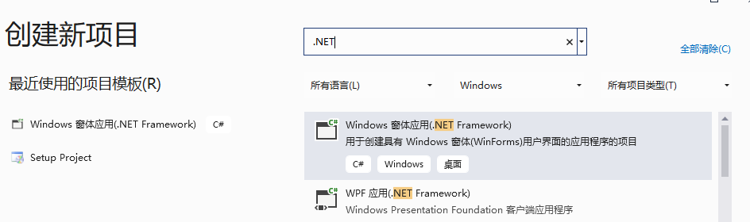
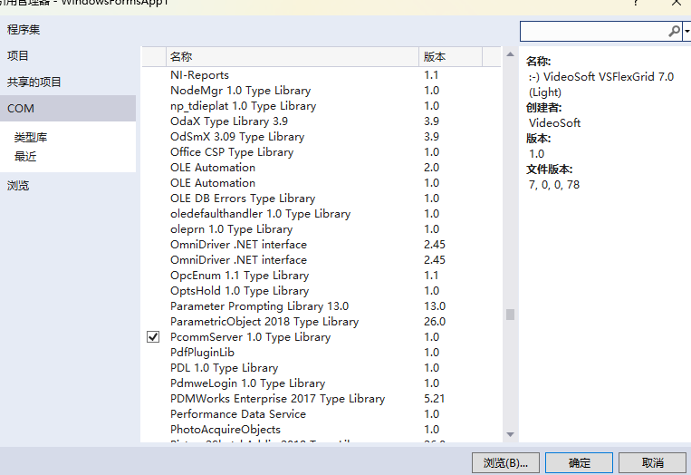
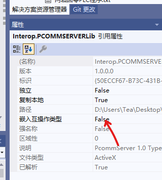
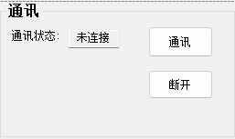
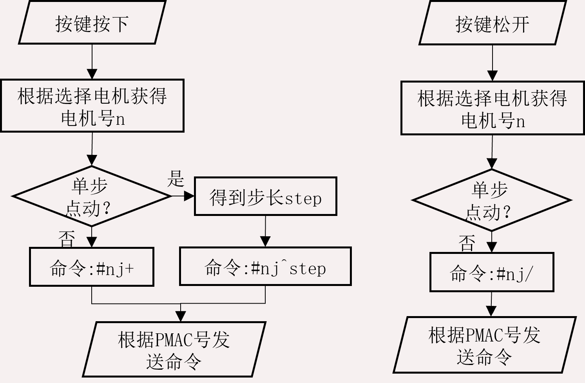
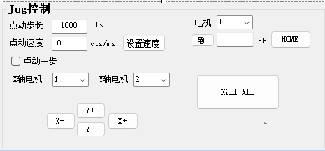
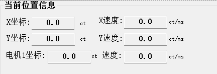
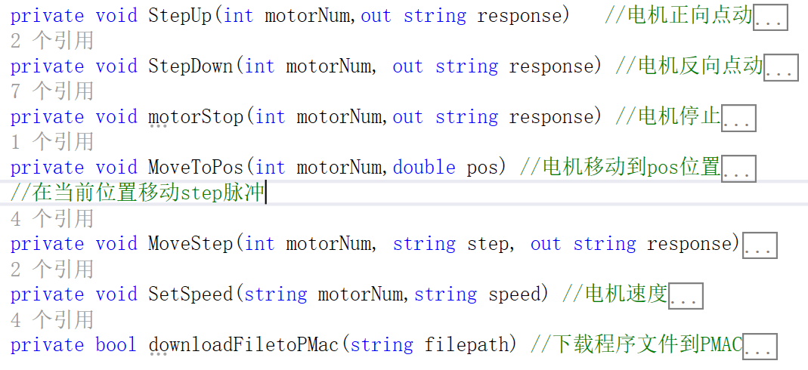
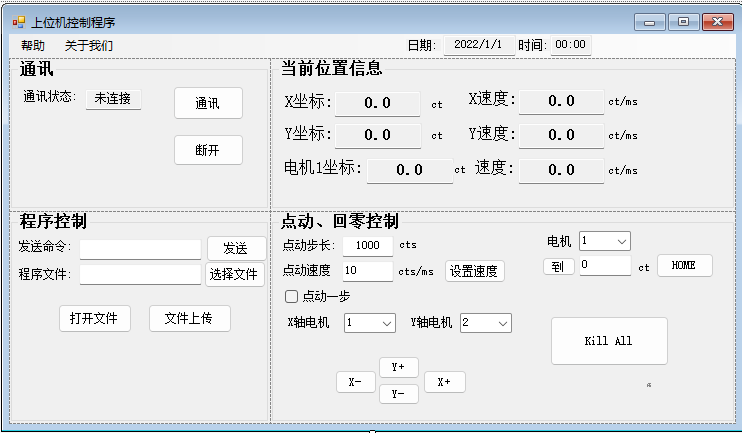

# PMAC CSharp 在C#中控制PMAC  

**摘要**：设计上位机，控制下位机(PMAC)。在C#中，与PMAC卡建立通讯，控制PMAC卡，控制电机、显示电机的位置、转速，进行PLC文件的下载。
(因个人能力，存在不足，见谅)。

---
**目录**：
- [PMAC介绍](#pmac)  
- [环境](#环境)
- [通讯](#通讯)  
- [Jog实现](#jog实现)
- [位置、速度读取](#位置速度读取)  
- [PLC文件下载](#plc文件下载)
- [代码简介](#代码简介)
---

## PMAC
- PMAC(Programmable Multi-Axis Controller)：可编程多轴控制器，Delta Tau公司生产的运动控制器，是开放式数控系统控制器。[PMAC](https://baike.baidu.com/item/PMAC%E5%8F%AF%E7%BC%96%E7%A8%8B%E5%A4%9A%E8%BD%B4%E6%8E%A7%E5%88%B6%E5%99%A8%E7%AE%80%E4%BB%8B/15641480)  

## 环境：
- [安装PeWinPro 2](https://github.com/lin-tea/PMAC_LabView/tree/main/Sources)  
- C# (vs2022,.NET4)
- 通讯时，注意要管理员权限(windows)。 
- 用Ethenet进行连接时，注意IP的设置[参考](https://blog.csdn.net/qq_42807924/article/details/95048605)。
- [编程手册参考](https://github.com/lin-tea/PMAC_LabView/blob/main/Sources/PcommServer%20Library%20of%20PMAC%20Functions%20.pdf)  

## 程序建立调用
- 程序的建立:
	- 打开
	<div align=center>
		  </div>
	
- 引用Pcomserver.dll
	- 在项目的`解决方案资源管理器`中的`引用`,右击，选择`添加引用`，在`COM`中找到Pcomserver,添加确定。
	<div align=center>
		</div>
	
- 在C#中的调用:
	```c#
	using PCOMMSERVERLib;   // PMAC 调用库	
	```  
	如果没报错，OK。
	(注意：调用的dll属性，互嵌入操作需要改成false)  
	<div align=center>
		</div>  
		
## 主要函数使用:
- 函数  

  |函数|功能|手册页数|
  |---|---|---|
  |*SelectDevice()*|选择PMAC卡|p38|
  |*Open()*|连接PMAC卡|p39|
  |*GetResponseEx()*|发送命令到PMAC卡|p41|	

- PMAC下位机命令:
  |命令|功能|
  |---|---|
  |#nj+|正向连续点动|
  |#nj-|反向连续点动|
  |#nj/|停止、闭环|
  |#nj={*C*}|到C位置,单位脉冲|
  |#nj^{*C*}|运动C个脉冲|
  |#nP|获取位置，单位脉冲|
  |#nHOMEZ|置当前位置为0点|  
  
其中(n表示电机号，C表示常数)
		
## 通讯
- 参考手册，使用函数:`SelectDevice()` + `open()`  
先选择PMAC卡，得到PMAC卡号后，再进行OPEN。  
	- `SelectDevice(0, out pmacNumber, out selectPmacSuccess)`:  
		选择PMAC卡号、连接方式。其中，第一个参数0表示显示连接窗口，选择后PMAC的卡号将输出到pmacNumber变量中，其是主窗口类的一个属性，其他方法可在选择、连接成功后使用该PMAC号与PMAC卡进行通讯；*selectPmacSuccess*为选择状态，选择成功将变为`True`。  
	
	- `Open(pmacNumber, out openPmacSuccess)`:  
		根据卡号与PMAC进行通讯，若成功，openpmacSuccess变为True，其也是主		窗口类的一个属性，连接成功后才能进行如点动等控制。  
		
```c#
	//######## PMAC连接、断开 #########
	// 这里为按键click触发执行函数
	private void selectDevice_Click(object sender, EventArgs e)  //选择、连接PMAC
	{
	
	    PMAC.SelectDevice(0, out pmacNumber, out selectPmacSuccess);
	    if (selectPmacSuccess)    //检验Pmac是否能选择
	    {
	        PMAC.Open(pmacNumber, out openPmacSuccess);
	        if (openPmacSuccess)   //PMac是否成功打开
	        {
	            this.selectStatus.ResetText();
	            this.selectStatus.AppendText("通信中!");
	            this.selectStatus.Show();
	            MessageBox.Show($"Successful to Open PMac {pmacNumber} card!");
	        }
	        else
	        {
	            MessageBox.Show("File to Open PMAC card!");
	        }
	    }
	}
```

-  GUI如下:  

<div align=center>
		</div>    
		
	
## Jog实现
- 命令: 控制电机n。正反向运动、点动规定脉冲数、到达某位置、当前位置置为0。根据PMAC在线执行命令，以及`GetResponse()`函数，控制电机。  

- 函数使用：`GetResponse(pmacNumber, command, out response)`:
	根据PMAC卡号	(pmacNumber)对PMAC卡发送直接执行命令command(以#开头命令)，得到反馈(response)。

- 实现(正向点动):  
<div align=center>
		</div>  

- GUI:
<div align=center>
		</div>  

- 点动速度:
	- 命令: In22=speed;其中，n表示电机号，speed表示速度，单位cts/ms。
	- 发送此命令到PMAC中，PMAC将电机n的速度设置为speed(读取速度文本框内容获得)。实际实现	中，我们对其进行了软限制，即不能速度太大，但其超过15cts/ms时，自动将其设置为15cts/ms，从而对设备进行保护。  

- 代码:
```c#
	private void StepUp(int motorNum,out string response)   //电机正向点动
	{   /*
	     motorNum: 电机号 
	        PLC: 代码 #1j+
	     */
	    string question = "#" + motorNum.ToString() + "j+";
	    PMAC.GetResponse(pmacNumber, question, out response);
	}
	private void StepDown(int motorNum, out string response) //电机反向点动
	{
	    string question = "#" + motorNum.ToString() + "j-";
	    PMAC.GetResponse(pmacNumber, question, out response);
	}
	private void motorStop(int motorNum,out string response) //电机停止
	{   
	    string question = "#" + motorNum.ToString() + "j/";
	    PMAC.GetResponse(pmacNumber, question, out response);
	}
```


## 位置速度读取
- 同上，使用`GetResponse()`函数。
	1)	实现方法：在c#中使用定时时间为500ms的定时器，每次定时时间到，向PMAC卡发送信息，得到X、Y、所选电机的位置，单位为脉冲(ct)。而速度则，通过当前获得的位置信息，与上一个定时触发时刻的位置相减，得到速度差再除以定时时间500ms得到速度，单位(cts/ms)。
	2)	**使用命令**: #nP; 其中，n表示电机号；
	3)	使用函数方法: GerResponse(pmacNumber, command, out response)；
	其中command即为“#nP”，response为PMAC返回的n号电机当前的位置，单位为脉冲(ct)，	数据类型为字符串。

- 主要代码:
	```c#
	string motor1P,motor2P,motorP;   // 保存各电机位置
	string question = "#"+xMotorNum.ToString()+"P";  //X轴电机位置命令
	PMAC.GetResponse(pmacNumber,question,out motor1P);
	question = "#" + yMotorNum.ToString() + "P";     //Y轴电机位置命令
	PMAC.GetResponse(pmacNumber, question, out motor2P);
	question = "#" + motorCombo.Text + "P";          //所选电机位置命令
	PMAC.GetResponse(pmacNumber, question, out motorP);
	```                                                         

- GUI:
<div align=center>
		</div>  

## PLC文件下载
- 核心方法：`Download(pmacNumber, filepath, bMacro: false, bMap: false, bLog: true, bDnld: true, out bool flag)`。
其中，filepath即为选择的程序文件路径， bLog表示是否生成log文件，设其为真(True)，若出现错误，我们可通过日志log进行错误寻找，bDnld表示将最终程序发送到PMAC执行。核心代码如下:(此法下载文件可能会出现乱码,解决办法是：去掉中文注释)。  

	```c#
	private bool downloadFiletoPMac(string filepath) //下载程序文件到PMAC
	{ 
	      // 如果文件路径有
	      if (filepath == null) return false;
	      //下载文件到PMAC中
	      PMAC.Download(pmacNumber, filepath, bMacro: false, bMap: false, 
	           bLog: true, bDnld: true, out bool flag);
	      //返回下载的结果成功或者失败
	      return flag; 
	}
	```

## 代码简介  
- 属性:  
	```c#
	public static PmacDeviceClass PMAC;    // PMAC卡
	public bool selectPmacSuccess = false; // 选择状态
	public bool openPmacSuccess = false;   // 打开状态
	public int pmacNumber;                 // PMAC卡number
	public string filename;
	public double xPrePos,yPrePos,prePos;  //x、y前时间段的位置 用于计算速度
	private int xMotorNum,yMotorNum;
	```

--方法:  
<div align=center>
		</div>  

--GUI:  
<div align=center>
		</div>  

---  
